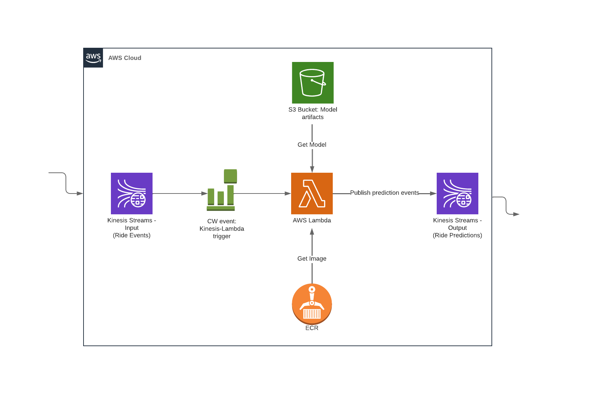

# Real-Time-Fraud-Detection
Designed and implemented a real-time fraud detection pipeline leveraging AWS Kinesis and Lambda to deliver scalable, low-latency predictions. Incoming transaction data streams into Kinesis Data Streams, triggering Lambda functions that run fraud detection models and generate predictions instantly. The predicted results are then sent to a separate Kinesis stream for downstream processing or alerting.

Infrastructure provisioning and deployment are automated using Terraform, ensuring reproducible and scalable environments. CI/CD pipelines built with GitHub Actions streamline code integration, testing, and deployment, promoting rapid and reliable updates.

Future plans include adding unit testing to improve code reliability and implementing model monitoring to track prediction accuracy and drift, ensuring ongoing model effectiveness and compliance

